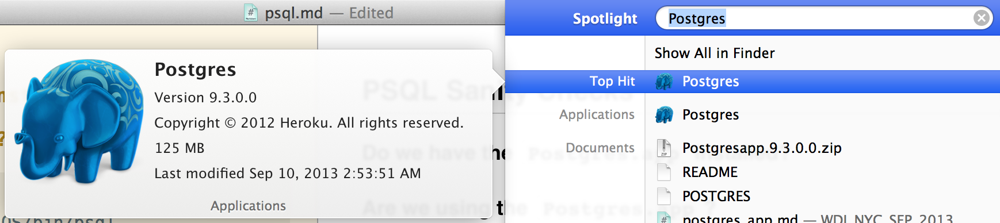

## PSQL Sanity Checks

###1. Do we have the `Postgres.app` installed?

If not `download` it from [postgresapp.com](http://postgresapp.com/)

Make sure it's in your `Applications` folder.

###2. Are we using the `Postgres.app`?

```
$ which psql
/Applications/Postgres.app/Contents/MacOS/bin/psql
```

If not our `bash_profile` may need to be updated to include the correct path. 

```
# ~/.bash_profile
PATH="/Applications/Postgres.app/Contents/MacOS/bin:$PATH"
```


###3. Do we see a little  Elephant in our Menubar?

This is __good__. It means our `psql` server is __running__.

If not `open` the `Postgres.app`

###4. Can we run `psql`?

```
$ psql
psql (9.3.0)
Type "help" for help.

philco=# 
```

Type `\q` to `exit` psql.